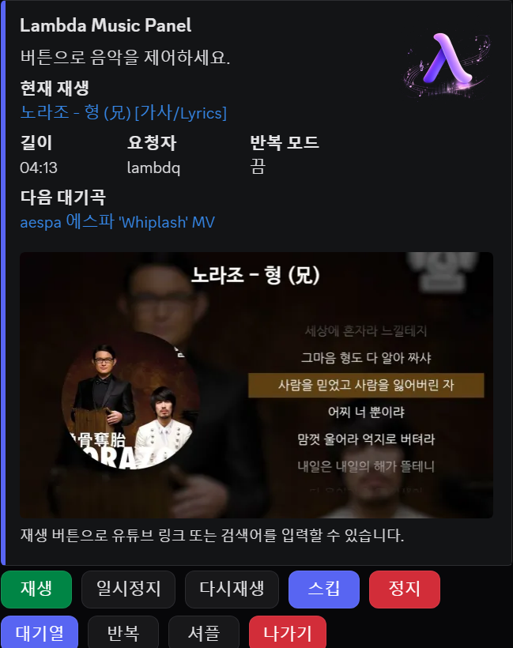

# Lambda Music

`discord.py` 기반의 음악 봇입니다.

## 패널 미리보기


## 실행 방법
1. Python 설치
2. FFmpeg 설치 후 PATH 등록
3. 프로젝트 폴더에서 아래 실행

```bash
python -m venv .venv
.venv\Scripts\activate
pip install -r requirements.txt
copy .env.example .env
```

`.env`의 `DISCORD_TOKEN` 값을 실제 봇 토큰으로 변경하세요.

## FFmpeg 설치 (Windows)
1. [FFmpeg 공식 빌드 페이지](https://www.gyan.dev/ffmpeg/builds/)에서 `release builds`의 zip 파일 다운로드
2. 압축 해제 후 예시 경로로 이동: `C:\ffmpeg\`
3. `C:\ffmpeg\bin` 경로를 시스템 환경 변수 `Path`에 추가
4. 새 터미널을 열고 아래로 확인

```bash
ffmpeg -version
```

버전 정보가 출력되면 설치가 정상 완료된 상태입니다.

### 터미널로 설치 (Windows)
`winget` 사용:

```bash
winget install --id Gyan.FFmpeg -e
ffmpeg -version
```

`choco` 사용:

```bash
choco install ffmpeg -y
ffmpeg -version
```

## 실행
```bash
python main.py
```
